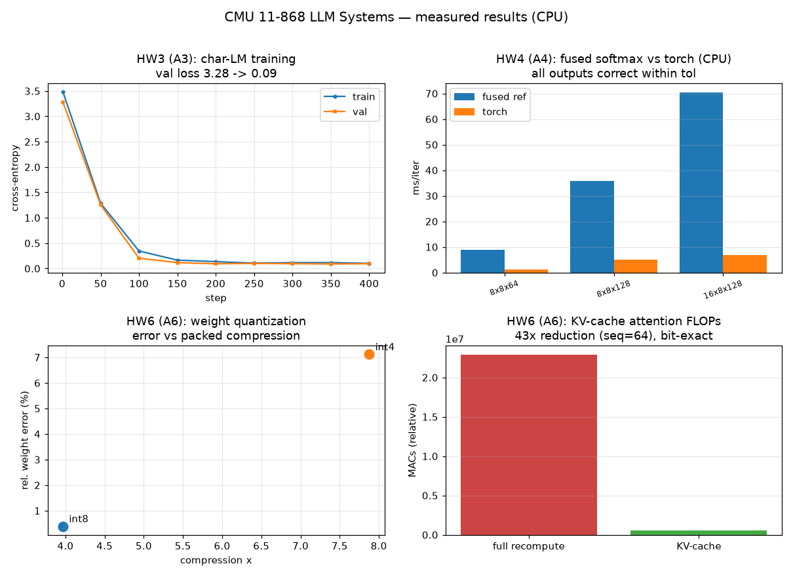

# CMU 11-868 — Large Language Model Systems

> A from-scratch implementation of the CMU 11-868 assignment stack — an autodiff
> engine, a decoder-only Transformer, fused attention/LayerNorm kernels,
> data- & pipeline-parallel training, and inference-systems techniques
> (KV-cache, quantization, LoRA) — an independent, from-scratch implementation of
> **11-868 — Large Language Model Systems** (Carnegie Mellon University), part of a
> [csdiy.wiki](https://csdiy.wiki/) full-catalog build.


## Overview

CMU 11-868 is a systems course that builds a small LLM training/inference stack
by hand, extending the MiniTorch framework with CUDA and scaling it across
GPUs. This repo reimplements the assignment stack from scratch in NumPy/PyTorch
and runs every piece **for real on CPU**: a reverse-mode autodiff engine, a
GPT-2-style decoder that trains end-to-end, the *fused* math behind the
hand-written CUDA softmax/LayerNorm kernels, genuine multi-process
data-parallel and GPipe pipeline-parallel training via `torch.distributed`
(gloo), and the core inference-systems techniques (KV-cache, int8/int4 weight
quantization, LoRA). The CUDA kernels and GPU-cluster/7B-scale runs are shipped
as documented partials — everything CPU-runnable is verified with measured
numbers.

## Results (measured on CPU, `OMP_NUM_THREADS=3`, torch 2.12.1+cpu)



| Assignment (course #) | What it does | Result (measured) |
|---|---|---|
| **A1/A2 — Autodiff + ops** | reverse-mode autodiff engine; MLP sentiment classifier trained through it | **test acc 0.992**, train acc 1.000; grads match finite-diff & PyTorch |
| **A3 — Transformer** | decoder-only GPT (char-LM) trained end-to-end | val loss **3.28 → 0.089**, perplexity **1.09** |
| **A4 — Fused CUDA kernels** | fused attention-softmax & LayerNorm (fwd+bwd) | all outputs correct vs PyTorch (max err ≤ 4e-15) |
| **A5 — Data parallelism** | dataset sharding + all-reduce gradient sync (gloo, 2 procs) | **converges** rank-0 loss 3.64 → 0.26; synchronous SGD verified |
| **A5 — Pipeline parallelism** | `_split_module` + GPipe `_clock_cycles` + `Pipe` | pipelined forward **bit-exact** vs un-pipelined (err 4.8e-7); loss 3.52 → 0.013 |
| **A6 — KV-cache** | incremental decoding with a key/value cache | **bit-exact** vs full recompute; **43× attention-FLOP** reduction (seq 64) |
| **A6 — Quantization** | per-row symmetric int8/int4 weight quant | int8 **0.4%** err @ **3.97×**; int4 7.1% err @ **7.88×** |
| **A6 — LoRA** | frozen base + trainable low-rank update | **16× fewer** trainable params; fine-tune loss 0.667 → 0.523, base stays frozen |

All raw numbers are in [`results/`](results/) (`hw1_*`…`hw5_*.json`), and
`results/summary.png` is rendered from them by `results/make_figure.py`.

## Implemented assignments

- [x] **A1/A2 — Autodiff framework + ops** — `topological_sort`, `backpropagate`, a NumPy tensor autograd engine (map/zip/reduce/matmul), and an MLP sentiment classifier trained on it.
- [x] **A3 — Decoder-only Transformer** — Linear/Embedding/LayerNorm/Dropout, causal multi-head attention, GELU FFN, pre-LN blocks, trained as a char-level LM.
- [x] **A4 — Fused CUDA kernels** — fused attention-softmax and LayerNorm forward/backward; CUDA `.cu` sources plus the numerically-identical CPU reference that the kernel unit tests check against, benchmarked vs PyTorch.
- [x] **A5 — Distributed training & parallelism** — data parallelism (`DataPartitioner`, `partition_dataset`, `average_gradients`) and pipeline parallelism (`_split_module`, `_clock_cycles`, `Pipe`), run as real multi-process gloo jobs.
- [x] **A6 — Advanced training & inference** — KV-cache incremental decoding, int8/int4 weight quantization (`QuantizedLinear`), and LoRA (`LoRALinear`) with a real parameter-efficient fine-tuning run.

## Project structure

```
cmu11868-llm-systems/
├── hw1_autodiff_ops/     # A1/A2: autodiff engine, tensor ops, MLP sentiment, cuda/combine.cu
├── hw2_transformer/      # A3: autograd Values, modules, nn_functions, train_lm
├── hw3_fused_kernels/    # A4: fused softmax/layernorm reference + cuda/*.cu + benchmark
├── hw4_parallelism/      # A5: model, data_parallel, pipeline, run_data_parallel, run_pipeline
├── hw5_inference/        # A6: kv_cache, quantization, lora, run_inference
├── tests/                # 50 pytest tests across all assignments
├── results/              # measured JSON evidence + summary.png + make_figure.py
├── requirements.txt
└── LICENSE
```

## How to run

```bash
# Python repos use the shared csdiy env (Python 3.11):
#   D:\Project\_csdiy\.venv-ml\Scripts\python.exe
python -m pip install -r requirements.txt   # or reuse the shared venv
export OMP_NUM_THREADS=3                     # CPU-modest

# Run everything (produces results/*.json):
python -m hw1_autodiff_ops.mlp_sentiment     # autodiff MLP  -> hw1_mlp_sentiment.json
python -m hw2_transformer.train_lm           # transformer LM -> hw2_lm_report.json
python -m hw3_fused_kernels.benchmark        # fused kernels  -> hw3_kernel_benchmark.json
python -m hw4_parallelism.run_data_parallel  # 2-proc gloo DP -> hw4_data_parallel.json
python -m hw4_parallelism.run_pipeline       # GPipe pipeline -> hw4_pipeline.json
python -m hw5_inference.run_inference         # kv/quant/lora  -> hw5_inference.json
python -m results.make_figure                # -> results/summary.png

# Full test suite (50 tests, incl. a live 2-process gloo all-reduce):
python -m pytest tests/ -q
```

## Verification

- **Autodiff (A1/A2):** every op's gradient is checked against central finite
  differences and against PyTorch's autograd in `tests/test_hw1_autodiff.py`;
  the MLP trains to 0.992 test accuracy end-to-end.
- **Transformer (A3):** module forwards are checked against PyTorch references;
  the LM training curve (loss 3.28 → 0.089) is in `results/hw2_lm_report.json`.
- **Fused kernels (A4):** the fused softmax/LayerNorm reference matches PyTorch
  to ≤ 4e-15 at every benchmarked size (`results/hw3_kernel_benchmark.json`).
- **Parallelism (A5):** `run_data_parallel` spawns two OS processes that
  all-reduce gradients each step and converge; `run_pipeline` verifies the
  GPipe schedule visits every `(micro, stage)` once and that the pipelined
  forward is bit-for-bit equal to the un-pipelined model. `tests/test_hw4_parallelism.py`
  includes a live 2-process gloo all-reduce.
- **Inference (A6):** KV-cache decoding is bit-exact vs full recompute;
  quantization and LoRA numbers (error, compression, param reduction, a real
  fine-tune that lowers the loss with the base weight frozen) are in
  `results/hw5_inference.json`.

### Documented partials (need a GPU / GPU cluster)

- **CUDA kernels (A4)** — `hw3_fused_kernels/cuda/*.cu` and
  `hw1_autodiff_ops/cuda/combine.cu` are real CUDA sources but require an NVIDIA
  GPU + `nvcc` to compile/run. On this CPU-only box we verify the *identical
  fused math* via the CPU reference the kernel tests use; GPU wall-clock
  speedups are not measured here.
- **Multi-GPU wall-clock (A5)** — data- and pipeline-parallel *correctness* is
  verified with real multi-process gloo jobs on CPU, but the >1.5× throughput
  speedup the assignment targets needs multiple GPUs with NCCL; on CPU the
  extra process/communication overhead makes the distributed run slower, as
  expected.
- **7B-scale training & SGLang serving (A6)** — DeepSpeed-ZeRO fine-tuning of
  LLaMA-2-7B and the SGLang/RadixAttention server need 16 GB+ GPUs. We implement
  and verify the underlying techniques (KV-cache reuse, quantization, LoRA) at
  CPU scale instead.

## Tech stack

Python 3.11, NumPy (autodiff engine, fused-kernel reference), PyTorch 2.12 CPU
(`torch.distributed`/gloo, `torch.multiprocessing`, the parallelism & inference
code), matplotlib (figure), pytest. CUDA C++ for the kernel sources.

## Key ideas / what I learned

- Reverse-mode autodiff: a computation graph, topological ordering, and the
  chain rule are enough to differentiate anything — including the subtle bug
  where a *no-grad intermediate* must not be seeded in the backward pass.
- A Transformer is just embeddings → pre-LN residual (attention + GELU MLP)
  blocks → LM head, and it trains fine at CPU scale.
- Softmax and LayerNorm are memory-bound; *fusing* the max/exp/normalize (or
  mean/var/affine) into one pass is why hand-written kernels win on GPUs.
- Synchronous data-parallel SGD is "replicate the model, shard the data,
  all-reduce the gradients"; pipeline parallelism (GPipe) overlaps micro-batches
  across stages via a clock-cycle schedule — and both must produce the *same*
  math as single-device training.
- Inference systems are about doing less work: a KV-cache turns O(T²) decoding
  into O(T); low-bit weight quantization trades a little accuracy for a big
  memory cut; LoRA fine-tunes with orders of magnitude fewer parameters.

## Credits & license

Based on the assignments of **CMU 11-868 Large Language Model Systems** by
Prof. Lei Li and the course staff at Carnegie Mellon University
([course site](https://llmsystem.github.io/), [assignments](https://llmsystem.github.io/llmsystemhomework/)).
This repository is an independent educational reimplementation; all course
materials, datasets, and specifications belong to their original authors.
Original code in this repo is released under the [MIT License](LICENSE).
